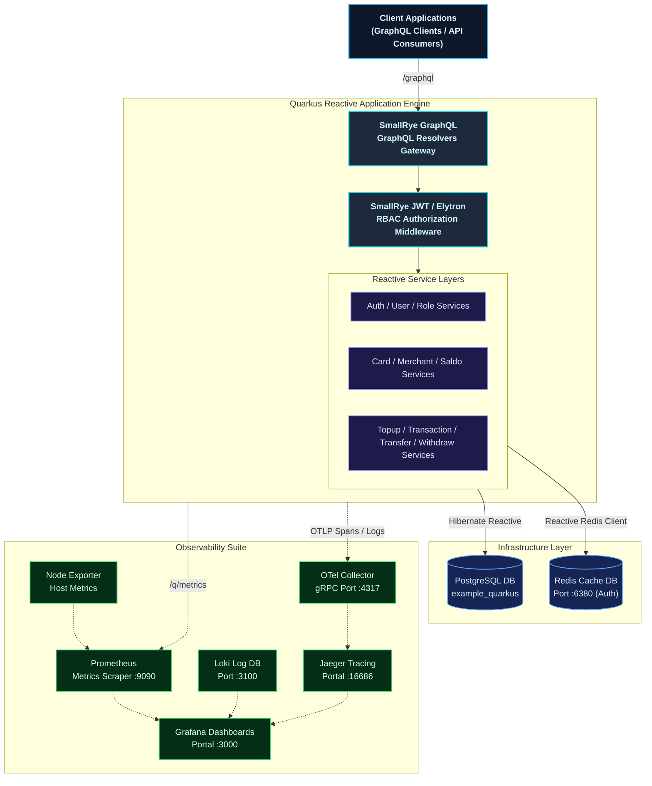
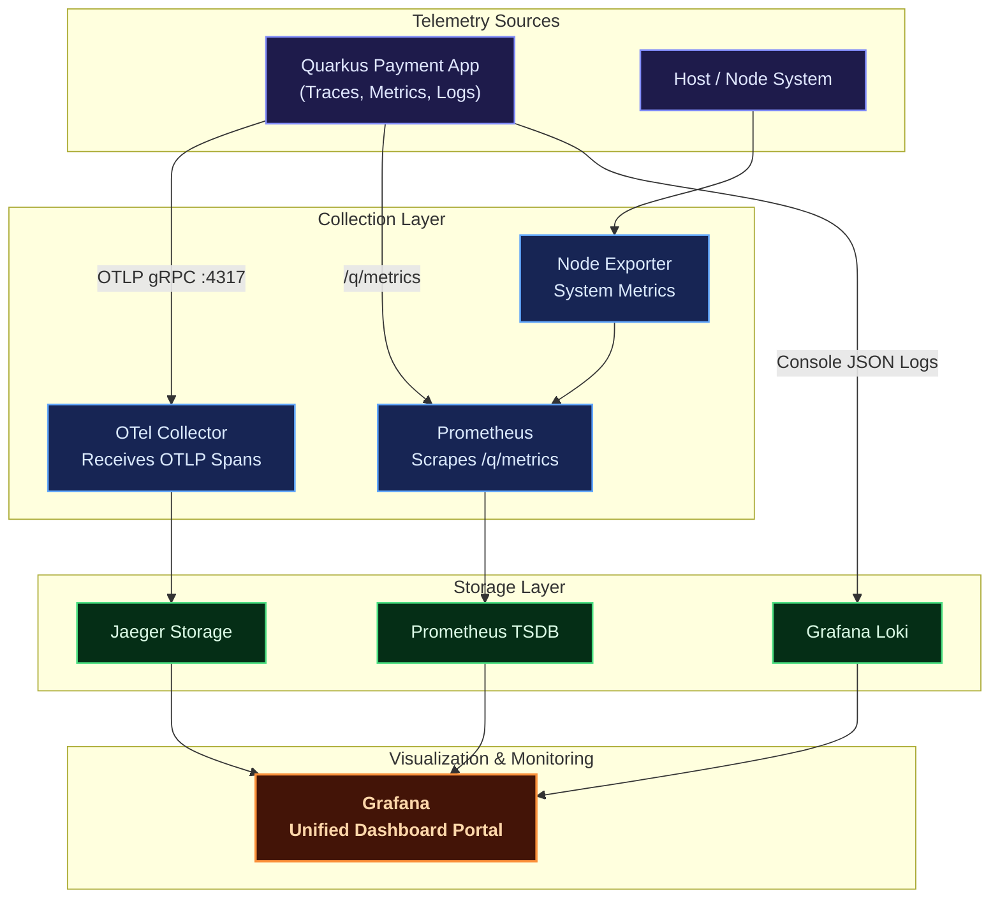

# Observable Reactive GraphQL Payment Gateway Platform — Quarkus v3

A production-grade, highly resilient, and fully observable **reactive payment gateway backend** built on the **Quarkus 3.x** framework (Java 21). Designed around domain-driven clean architecture principles, it utilizes a non-blocking reactive stack powered by **Mutiny**, **Hibernate Reactive with Panache**, and **SmallRye GraphQL** to achieve peak throughput and sub-millisecond execution latencies.

The system is fortified with a **comprehensive observability suite** comprising OpenTelemetry, Jaeger, Prometheus, Grafana, Loki, and Node Exporter, fully integrated via Docker Compose to offer instant dashboard-level visibility from SQL statements up to the GraphQL layer.

---

## Key Features

| Domain Module | Capabilities |
| :--- | :--- |
| **Auth & Users** | Secure registration, login, logout, and JWT token lifecycle (access & refresh tokens with custom RSA key signing) via GraphQL mutations and queries. |
| **Roles & RBAC** | Custom permission configurations and granular role-based security filters mapping directly to Quarkus `@RolesAllowed` in GraphQL schemas. |
| **Cards & VCC** | Virtual and debit card CRUD operations with soft-delete capabilities, card activation/suspension toggles, and multi-dimensional transaction analytics. |
| **Merchants** | Fully featured merchant onboarding, profile details management, and merchant performance/transaction reports with full data restoration capabilities (soft delete & restore). |
| **Saldo (Balance)** | High-throughput, thread-safe real-time balance calculations, optimistic concurrency locks, and localized balance logs. |
| **Topup** | Balance loading ledger engine supporting multiple payment methods, detailed transactions logging, and soft-delete audit records. |
| **Transaction** | Centralized financial audit ledger collecting transaction events across the system, global search filters, status tracking, and monthly/yearly volume reports. |
| **Transfer** | Peer-to-peer card-to-card or user-to-user funds settlement with balance debit/credit synchronization and event-driven logging. |
| **Withdraw** | Funds settlement from user cards to external accounts/banks, daily transaction threshold limits, and status processing pipelines. |
| **Observability** | Fully integrated telemetry collecting traces, metrics, and logs (OpenTelemetry, Prometheus, Jaeger, Loki, Grafana, Node Exporter). |
| **Containerized Setup**| Local orchestration using Docker Compose featuring an authenticated Redis instance, PostgreSQL, and the full observability stack. |

---

## 🏛️ Architecture Overview

The platform implements a **decoupled domain structure** within a single highly optimized reactive runtime unit. It utilizes a fully non-blocking asynchronous I/O thread model powered by **Eclipse Vert.x** under the hood of Quarkus.

### Core Architecture Principles

*   **Non-Blocking Asynchronous I/O**: High-performance GraphQL and DB operations use Mutiny `Uni` objects to ensure no OS threads are blocked under high request load.
*   **Active Record & Repository Pattern**: Clean persistence separation using Hibernate Reactive with Panache, guaranteeing asynchronous database interaction.
*   **Flyway Database Migrations**: Seamless version control for database schemas, run automatically on application startup.
*   **RSA Signed JWT Authentication**: Stateless request authorization handled by SmallRye JWT, verified securely via public keys.
*   **OpenTelemetry & Context Propagation**: Automatic propagation of `traceId` and `spanId` from GraphQL resolvers down to Hibernate SQL executions, injected dynamically into log statements.



---

## Telemetry & Observability Architecture



---

## Technology Stack

| Category | Technologies | Purpose |
| :--- | :--- | :--- |
| **Programming Language**| Java 21 (JDK 21) | Ultra-fast execution, native image support, modern thread constructs. |
| **Framework Engine** | Quarkus v3.30+ | Supersonic Subatomic Java framework with lightning fast boot time. |
| **Reactive Paradigm** | Mutiny | Advanced, non-blocking asynchronous event-driven development library. |
| **GraphQL Engine** | SmallRye GraphQL | MicroProfile GraphQL standards implementation utilizing build-time optimizations. |
| **ORM / Persistent** | Hibernate Reactive + Panache | Non-blocking database access wrapping the active-record repository. |
| **Database Engine** | PostgreSQL v17 | Persistent SQL transaction ledger database. |
| **Caching Core** | Redis v7.4 | Single Redis cache authenticated via `dragon_knight` password. |
| **Auth Tokens** | SmallRye JWT | RSA public/private key verification standards for APIs. |
| **DB Migrations** | Flyway | Structured schema migrations executed cleanly on system startup. |
| **Docker Engine** | Docker Compose | Local container virtualization and dependency staging. |

---

## Getting Started

### Prerequisites

Verify that the following configurations are installed on your workstation:
- [Git](https://git-scm.com/)
- [Java Development Kit (JDK 21+)](https://adoptium.net/)
- [Maven 3.9+](https://maven.apache.org/)
- [Docker Engine & Docker Compose](https://docs.docker.com/get-docker/)

---

### 1. Configure the Environment Stacks

Compile all backing containers and infrastructure utilities via Docker Compose:

```bash
docker-compose up -d
```

Verify that all services are healthy and running:

```bash
docker-compose ps
```

*Note: Postgres tables and baseline structures are automatically constructed on startup via the Flyway migration files located in `src/main/resources/db/migration`.*

---

### 2. Launching the App in Development Mode

Run the application in Quarkus Dev Mode with full live-coding hot reload enabled:

```bash
./mvnw quarkus:dev
```

> **GraphQL Playground Portal:** The SmallRye GraphQL UI playground is instantly accessible at `http://localhost:8080/q/graphql-ui` during dev mode.
> **Dev UI Portal:** The Quarkus Dev UI panel is instantly accessible at `http://localhost:8080/q/dev/` during active dev sessions.

---

### 3. Packaging and Running the App

Package the application into an optimized runnable Jar package:

```bash
./mvnw clean package
```

The compiled runner Jar will reside in the `target/quarkus-app/` directory. Launch it using:

```bash
java -jar target/quarkus-app/quarkus-run.jar
```

If you wish to compile a native executable direct binary via GraalVM/Mandrel:

```bash
./mvnw package -Dnative -Dquarkus.native.container-build=true
```

---

## GraphQL HURL Integration Testing

The application includes a complete suite of integration test suites written in **[Hurl](https://hurl.dev/)** to validate all GraphQL mutations, queries, headers, and access control policies.

All test suites are stored within the `hurl/` directory:

| Test File | GraphQL Target APIs | Description |
| :--- | :--- | :--- |
| **`auth.hurl`** | `AuthGraphQL` & `UserGraphQL` | Validates registration, login, refresh tokens, user updates, and logout. |
| **`card.hurl`** | `CardGraphQL` | Validates debit/virtual card creation, dashboard KPIs, trashing, and monthly balances. |
| **`merchant.hurl`** | `MerchantGraphQL` | Validates merchant registration, ApiKey generations, status changes, and multi-dim stats. |
| **`saldo.hurl`** | `SaldoGraphQL` | Validates balance allocation, modification, query, and ledger trashing. |
| **`topup.hurl`** | `TopupGraphQL` | Validates balance loading, methods usage, and audit trashing. |
| **`transaction.hurl`** | `TransactionGraphQL` | Validates payment card ledger records, API Key header matching (`X-api-Key`), and stats. |
| **`transfer.hurl`** | `TransferGraphQL` | Validates peer card-to-card transfer settlements, amounts verification, and stats. |
| **`withdraw.hurl`** | `WithdrawGraphQL` | Validates cash-out transactions, daily balance logs, and trashing. |

### Run all tests sequentially

```bash
hurl --test hurl/*.hurl
```

### Run a specific test with verbose request/response details

```bash
hurl --test --verbose hurl/01_auth.hurl
```

---

## Port Map Registry

| Application/Service Portal | Address Protocol / Access URL |
| :--- | :--- |
| **GraphQL API Endpoint** | `http://localhost:8080/graphql` |
| **GraphQL UI Playground** | `http://localhost:8080/q/graphql-ui` |
| **Quarkus Dev UI Dashboard** | `http://localhost:8080/q/dev/` (Dev Mode Only) |
| **Quarkus Health Check Page** | `http://localhost:8080/q/health` |
| **PostgreSQL Database** | `localhost:5432` (example_quarkus / password) |
| **Redis Cache Instance** | `localhost:6380` (password: `dragon_knight`) |
| **Jaeger Tracing Portal** | [http://localhost:16686](http://localhost:16686) |
| **Prometheus Console** | [http://localhost:9090](http://localhost:9090) |
| **Loki Log Portal** | `http://localhost:3100` |
| **Grafana Monitoring Dashboard**| [http://localhost:3000](http://localhost:3000) *(Credentials: `admin`/`admin`)* |
| **OpenTelemetry gRPC Collector**| `localhost:4317` |

---

## Workspace Directory Tree

```
payment-gateway-quarkus/
├── src/
│   ├── main/
│   │   ├── java/
│   │   │   └── com/example/
│   │   │       ├── config/            # Initializers and setups
│   │   │       ├── domain/            # Domain models, requests, and responses
│   │   │       ├── exception/         # Reactive custom domain exceptions & mappers
│   │   │       ├── graphql/           # GraphQL API Resolvers (10 modules)
│   │   │       │   ├── AuthGraphQL.java
│   │   │       │   ├── UserGraphQL.java
│   │   │       │   ├── RoleGraphQL.java
│   │   │       │   ├── CardGraphQL.java
│   │   │       │   ├── MerchantGraphQL.java
│   │   │       │   ├── SaldoGraphQL.java
│   │   │       │   ├── TopupGraphQL.java
│   │   │       │   ├── TransactionGraphQL.java
│   │   │       │   ├── TransferGraphQL.java
│   │   │       │   └── WithdrawGraphQL.java
│   │   │       ├── models/            # Hibernate Reactive Panache Entities
│   │   │       ├── repository/        # Reactive Persistence Repository layer
│   │   │       ├── security/          # Password and JWT services
│   │   │       └── service/           # Reactive Service interfaces & implementations
│   │   └── resources/
│   │       ├── db/migration/          # Flyway SQL schema scripts
│   │       ├── application.properties  # Central application configurations
│   │       ├── privateKey.pem         # RSA private key for JWT generation
│   │       └── publicKey.pem          # RSA public key for JWT validation
├── observability/                     # Telemetry configurations
│   ├── grafana/                       #   Grafana data source provisioning
│   ├── loki-config.yaml               #   Loki aggregator profile
│   ├── otel-collector.yaml            #   OpenTelemetry collector targets
│   └── prometheus.yml                 #   Prometheus metrics scraper targets
├── Dockerfile                         # JVM multi-stage deployment build
├── Dockerfile.native                  # GraalVM Native runtime build
├── docker-compose.yml                 # Local virtualization compose script
├── pom.xml                            # Maven workspace configurations
└── README.md                          # Platform instructions documentation
```

---

## License

This project is open-sourced under the MIT License for development and educational purposes.

---
<p align="center">
  Built with Java, Quarkus Reactive, Mutiny, SmallRye GraphQL, OpenTelemetry, and Grafana.
</p>